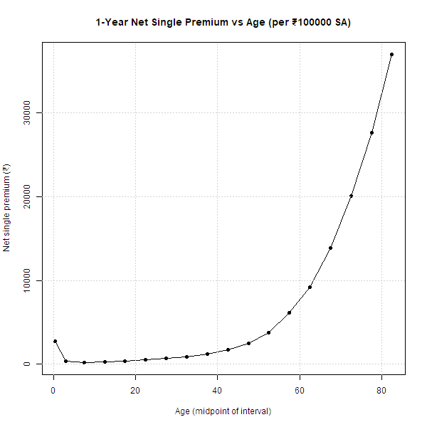

# Actuarial-Science-made-easy-
A simple demonstration of how age affects term insurance premiums using CM1 life table calculations.
# Actuarial Science Made Easy: Premium vs Age

This project shows how life insurance premiums change with age, using the 
concept of the **1-year net single premium (NSP)** from actuarial science.

## Key Idea
- Premium = Present Value of Expected Benefit
- Formula: NSP = v * qx * Sum Assured
- v = 1 / (1 + i), qx = probability of death at age x

## Results
The plot below shows how the premium is high at very young ages (due to infant mortality), 
very low in mid-life, and rises sharply in old age. 

## Next Steps
- Extend to n-year term insurance
- Add whole life premiums
- Compare across different interest rates
